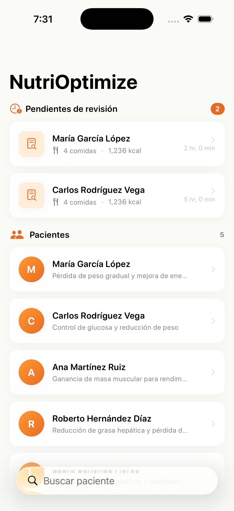
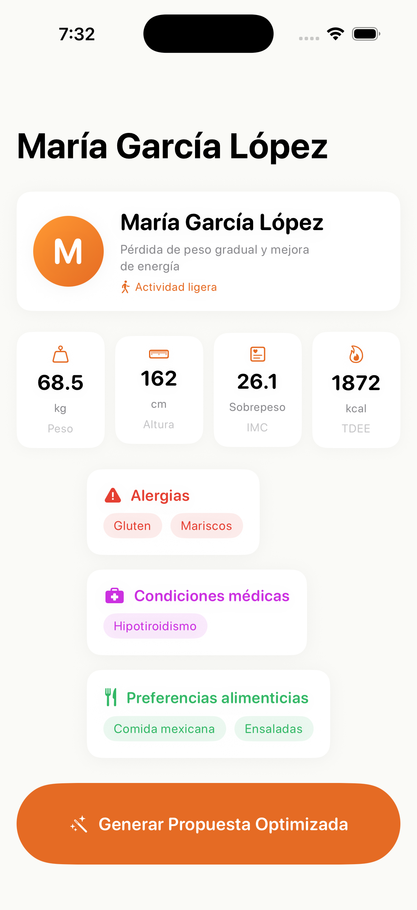
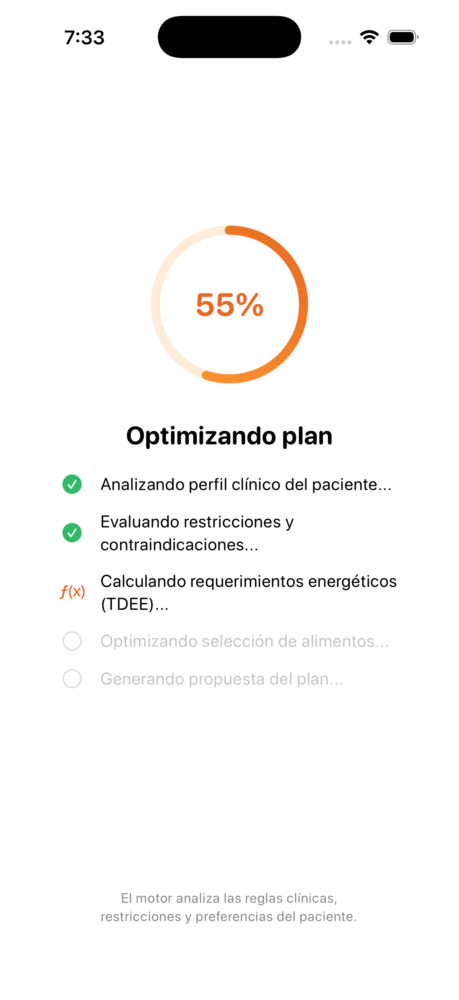
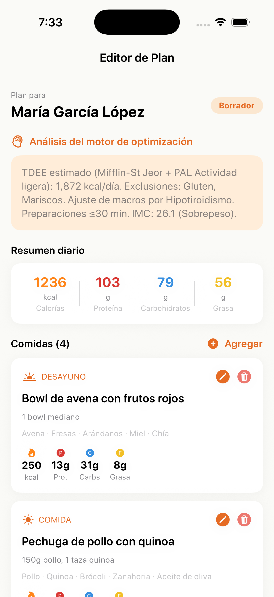

# NutriOptimize

**Plataforma de optimización nutricional centrada en el profesional**

NutriOptimize es una aplicación iOS diseñada para nutriólogos que combina un motor de optimización inteligente con un flujo de trabajo clínico centrado en el ser humano. El sistema genera planes alimenticios personalizados como **borradores** que el profesional revisa, edita y aprueba antes de entregarlos al paciente.

---

## Human-Centered AI (HCAI)

NutriOptimize fue diseñada desde cero siguiendo los principios de la Inteligencia Artificial Centrada en el Ser Humano:

### 1. El motor PROPONE, el nutriólogo DECIDE
El motor de optimización genera borradores de planes alimenticios, pero **nunca** toma decisiones autónomas. Todo plan pasa por la revisión y aprobación explícita del profesional antes de llegar al paciente.

### 2. Transparencia en el razonamiento
El sistema explica **por qué** sugiere cada alimento y distribución de macronutrientes. El nutriólogo puede inspeccionar el razonamiento clínico completo del motor, incluyendo el prompt enviado y la respuesta cruda, a través de la vista de depuración.

### 3. Control total del profesional
El nutriólogo puede **editar, agregar, eliminar y sobreescribir** cualquier comida, ingrediente o valor de macronutrientes sugerido por el motor. El borrador es completamente modificable antes de la aprobación.

### 4. Ética y privacidad
Los datos del paciente se almacenan exclusivamente en el dispositivo local (SwiftData). No se toman decisiones automatizadas: el motor es una herramienta de asistencia, no un sustituto del criterio profesional.

### 5. Diseño para flujos clínicos reales
La interfaz fue diseñada para el flujo de trabajo real de un nutriólogo: registrar paciente, generar borrador, revisar y editar, aprobar, exportar PDF y compartir por WhatsApp.

---

## Equipo

| Integrante | Rol |
|---|---|
| **Jorge Salgado Miranda** | Desarrollo iOS y arquitectura |
| **Michelle Paola González Martínez** | Diseño UX/UI e investigación |
| **Arroyo Ramírez Carlos Alberto** | Motor de optimización y pruebas |

---

## Stack Tecnológico

| Tecnología | Uso |
|---|---|
| **Swift 5.9+** | Lenguaje principal |
| **SwiftUI** | Interfaz de usuario declarativa |
| **SwiftData** | Persistencia local de pacientes |
| **iOS 17+** | Sistema operativo objetivo |
| **MVVM** | Patrón arquitectónico |
| **UIGraphicsPDFRenderer** | Generación de PDF profesional |
| **OpenRouter API** | Backend del motor de optimización |

---

## Funcionalidades

- **CRUD completo de pacientes con persistencia local (SwiftData)** — Crear, leer, actualizar y eliminar pacientes con datos clínicos completos almacenados en el dispositivo.
- **Motor de optimización inteligente con personalización de prompts** — Genera planes alimenticios personalizados considerando el perfil clínico, alergias, condiciones médicas, preferencias dietéticas y presupuesto del paciente.
- **Editor de borradores con edición granular de comidas** — Interfaz completa para modificar cada comida: nombre, ingredientes, macronutrientes, porciones. Agregar o eliminar comidas libremente.
- **Exportación a PDF profesional para compartir por WhatsApp** — Documento PDF con branding, datos del paciente, resumen nutricional, detalle de comidas y análisis del motor.
- **Panel de control con planes pendientes de revisión** — Dashboard que muestra pacientes y borradores que requieren atención del nutriólogo.
- **Cálculos clínicos: IMC, TMB (Mifflin-St Jeor), TDEE** — Cálculos antropométricos automatizados a partir de los datos del paciente.
- **Retroalimentación háptica y micro-animaciones** — Feedback táctil en interacciones clave para una experiencia profesional y fluida.
- **Paleta naranja/blanco profesional y minimalista** — Sistema de diseño cohesivo con tokens centralizados (`AppTheme`).
- **Búsqueda y filtrado de pacientes** — Barra de búsqueda integrada para localizar pacientes rápidamente.
- **Vista de depuración del motor de optimización** — Inspección del prompt enviado y la respuesta cruda del motor para verificación profesional.
- **Configuración de clave API y personalización del prompt** — El nutriólogo configura su conexión al motor y personaliza el comportamiento según su estilo de prescripción.
- **Consideración de presupuesto alimentario del paciente** — El motor prioriza ingredientes costo-efectivos cuando se especifica un presupuesto mensual en MXN.

---

## Capturas de Pantalla

| Dashboard | Perfil de Paciente | Procesamiento | Editor de Plan |
|---|---|---|---|
|  |  |  |  |

---

## Instalación y Configuración

```bash
# 1. Clonar el repositorio
git clone https://github.com/chochy2001/NutriOptimize.git
cd NutriOptimize

# 2. Abrir en Xcode
open NutriOptimize.xcodeproj

# 3. Seleccionar un simulador o dispositivo con iOS 17+

# 4. Build & Run (Cmd + R)
```

### Configuración del Motor de Optimización

1. Obtener una API key en [openrouter.ai/keys](https://openrouter.ai/keys)
2. En la app, ir a **Configuración** (icono de engranaje)
3. Ingresar la API key en el campo correspondiente
4. Opcionalmente, personalizar el prompt de optimización
5. Guardar

> Sin API key, la app funciona con datos de demostración para explorar la interfaz.

---

## Arquitectura

```
NutriOptimize/
├── Models/
│   ├── Patient.swift              # Perfil clínico con datos antropométricos
│   ├── Meal.swift                 # Comida con macronutrientes y tipo
│   ├── PlanOptimizationDraft.swift # Borrador de plan con estado de revisión
│   ├── Professional.swift         # Modelo del profesional
│   └── ServiceError.swift         # Errores tipados del dominio
├── Services/
│   ├── OpenRouterService.swift    # Motor de optimización (producción)
│   ├── PDFExportService.swift     # Generador de PDF profesional
│   ├── PatientStore.swift         # CRUD con SwiftData
│   ├── Protocols/
│   │   ├── OptimizationServiceProtocol.swift
│   │   └── PatientServiceProtocol.swift
│   └── Mock/
│       ├── MockOptimizationService.swift
│       └── MockPatientService.swift
├── ViewModels/
│   ├── OptimizationDashboardViewModel.swift
│   ├── PatientDetailViewModel.swift
│   └── DraftEditorViewModel.swift
├── Views/
│   ├── Dashboard/
│   │   └── OptimizationDashboardView.swift
│   ├── Patient/
│   │   ├── PatientDetailView.swift
│   │   └── AddEditPatientView.swift
│   ├── Draft/
│   │   ├── DraftEditorView.swift
│   │   ├── ProcessingStateView.swift
│   │   └── EngineDebugView.swift
│   ├── Settings/
│   │   └── SettingsView.swift
│   └── Components/
│       ├── EditMealSheet.swift
│       ├── MealRowView.swift
│       └── MacrosBadgeView.swift
└── Theme/
    ├── AppTheme.swift             # Tokens de diseño centralizados
    └── HapticManager.swift        # Retroalimentación háptica
```

### Patrón MVVM con Protocolos

- **Models** — Structs inmutables (`Patient`, `Meal`, `PlanOptimizationDraft`) que representan el dominio clínico.
- **ViewModels** — Clases `@MainActor` con `@Published` que gestionan estado y lógica de negocio.
- **Views** — Vistas declarativas en SwiftUI que observan los ViewModels.
- **Protocols** — `OptimizationServiceProtocol` y `PatientServiceProtocol` permiten inyectar implementaciones mock para pruebas y desarrollo sin dependencia del motor remoto.

---

## Roadmap

### Fase 2 — Seguimiento del Paciente
- Historial de consultas y progreso del paciente con gráficas
- Fotos de progreso del paciente con cámara
- Integración de estudios de laboratorio (sangre, etc.)

### Fase 3 — Productividad Clínica
- Agenda y citas
- Asistente contextual en cada sección
- Personalización del motor por paciente

### Fase 4 — Escala y Cumplimiento
- Sincronización con backend remoto
- Soporte multi-nutriólogo
- Cumplimiento NOM-051 y COFEPRIS

---

## Licencia

Proyecto desarrollado para hackathon. Todos los derechos reservados.
